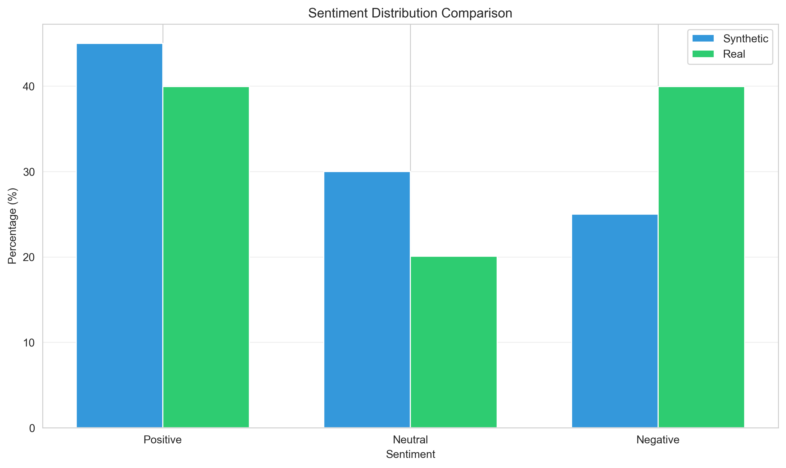
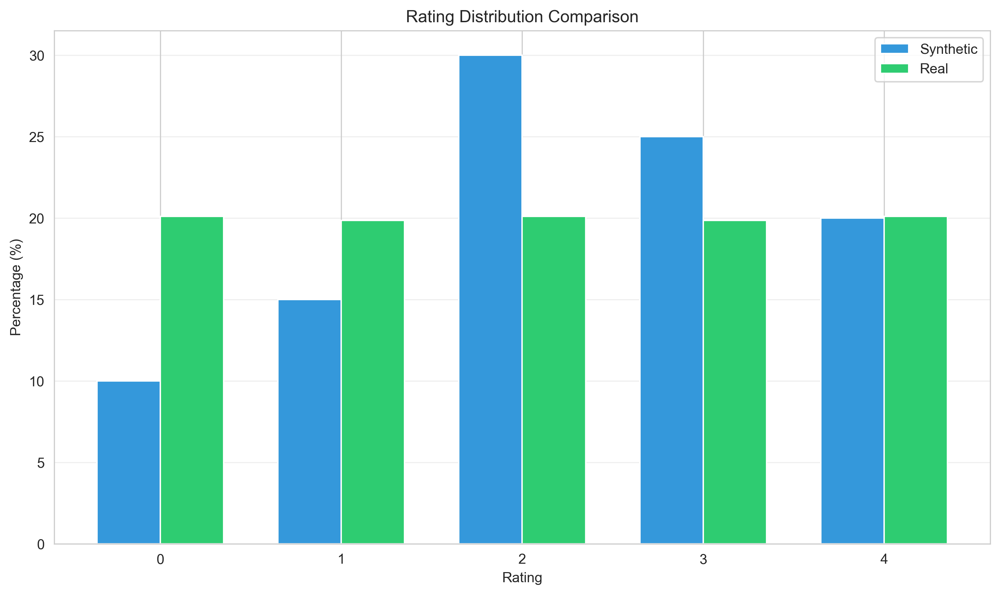
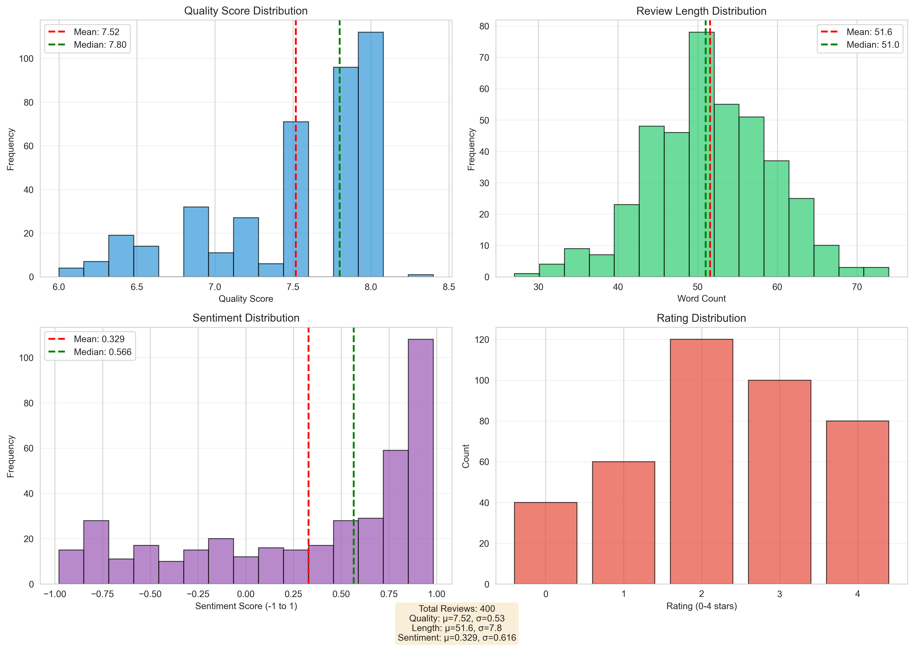

# Synthetic Review Generator

A sophisticated LangGraph-based system for generating high-quality synthetic product reviews using state-of-the-art LLMs with comprehensive quality control, cascading fallback strategies, and detailed analytics.

## Table of Contents

- [Overview](#overview)
- [Key Features](#key-features)
- [Architecture](#architecture)
- [Project Structure](#project-structure)
- [Installation](#installation)
- [Quick Start](#quick-start)
- [Configuration](#configuration)
- [Model Providers](#model-providers)
- [Quality Metrics](#quality-metrics)
- [Generated Outputs](#generated-outputs)
- [Development Journey](#development-journey)

---

## Overview

This project generates synthetic product reviews (specifically for shoes) using a multi-model LLM approach with intelligent fallback strategies. Built on **LangGraph**, it provides a stateful workflow that ensures high-quality review generation through iterative refinement and comprehensive quality checks.

### Why This Matters

- **Data Augmentation**: Generate training data for ML models
- **Testing**: Create realistic test datasets for review systems
- **Quality Benchmarking**: Compare synthetic vs. real review quality
- **Cost-Effective**: Generate thousands of reviews without manual effort

---

## Key Features

### Multi-Model Generation
- **Primary**: Azure Grok (grok-4-fast-reasoning) - Fast and reliable
- **Fallback**: Azure OpenAI (gpt-4.1-mini) - High quality backup
- **Context-Aware**: Uses real reviews as examples for better quality
- **Cascading Strategy**: 4-attempt fallback with increasing context

### Persona-Based Diversity
- 10 distinct personas (athlete, budget_shopper, quality_seeker, etc.)
- Configurable traits and characteristics
- Natural language variation
- Demographic diversity

### Comprehensive Quality Control
- **Real-time Quality Assessment**: Each review scored before acceptance
- **Iterative Refinement**: Automatic regeneration of low-quality reviews
- **Failure Analysis**: Identifies specific quality issues
- **Duplicate Detection**: Semantic similarity checks

### Advanced Analytics
- **Quality Metrics**: Diversity, Bias, Realism scores
- **Comparison Plots**: Synthetic vs. Real review analysis
- **Distribution Analysis**: Rating, sentiment, length distributions
- **Attempt Tracking**: Detailed logs of all generation attempts

### Intelligent Workflow
- **LangGraph State Machine**: Stateful review generation
- **Quality Gates**: Reviews must pass quality checks
- **Best Attempt Selection**: Chooses highest-scoring review if max attempts reached
- **Configurable Parameters**: Flexible generation settings

---

## Architecture

### System Components

```
┌─────────────────────────────────────────────────────────────┐
│                     User Interface                          │
│                      (run.py CLI)                           │
└────────────────────┬────────────────────────────────────────┘
                     │
                     ▼
┌─────────────────────────────────────────────────────────────┐
│              LangGraph Workflow Engine                      │
│                  (build_graph.py)                           │
├─────────────────────────────────────────────────────────────┤
│  ┌──────────────┐    ┌──────────────┐    ┌──────────────┐   │
│  │   Generate   │───▶│   Quality    │───▶│   Decision   │   │
│  │    Review    │    │    Check     │    │    Node      │   │
│  └──────────────┘    └──────────────┘    └──────────────┘   │
│         │                   │                     │         │
│         │                   │                     ▼         │
│         │                   │            ┌────────────────┐ │
│         │                   │            │  Pass? Retry?  │ │
│         │                   │            │   Give Up?     │ │
│         │                   │            └────────────────┘ │
│         ▼                   ▼                     │         │
└─────────────────────────────────────────────────────────────┘
          │                   │                     │
          ▼                   ▼                     ▼
┌─────────────────┐  ┌─────────────────┐  ┌─────────────────┐
│   Generators    │  │    Reviewers    │  │  Quality Tools  │
├─────────────────┤  ├─────────────────┤  ├─────────────────┤
│ • Grok          │  │ • Azure OpenAI  │  │ • Diversity     │
│ • Azure OpenAI  │  │   Reviewer      │  │ • Bias          │
│                 │  │                 │  │ • Realism       │
└─────────────────┘  └─────────────────┘  │ • Duplicate Det │
                                          └─────────────────┘
```

### Cascading Fallback Strategy

```
Attempt 1: Grok (No Context)
    │
    ├─ Pass ──▶ Accept Review
    │
    └─ Fail ──▶ Attempt 2: Grok (3 Real Review Examples)
                    │
                    ├─ Pass ──▶ Accept Review
                    │
                    └─ Fail ──▶ Attempt 3: Azure OpenAI (3 Examples)
                                    │
                                    ├─ Pass ──▶ Accept Review
                                    │
                                    └─ Fail ──▶ Attempt 4: Azure OpenAI (5 Examples)
                                                    │
                                                    ├─ Pass ──▶ Accept Review
                                                    │
                                                    └─ Fail ──▶ Select Best Attempt
```

---

## Project Structure

```
EasyGenerator/
│
├── models/                          # LLM Generator Implementations
│   ├── base_generator.py               # Base class for all generators
│   ├── azure_grok_generator.py         # Grok-4-Fast generator (Primary)
│   ├── azure_openai_generator.py       # GPT-4.1-mini generator (Fallback)
│   ├── azure_deepseek_generator.py     # DeepSeek-R1 (Experimental)
│   ├── azure_openai_reviewer.py        # Quality assessment reviewer
│   ├── huggingface_generator.py        # HuggingFace models (Tested but slow)
│   └── gemini_generator.py             # Google Gemini (Alternative)
│
├──   quality/                         # Quality Assessment Tools
│   ├── diversity.py                    # Vocabulary & semantic diversity
│   ├── bias.py                         # Rating distribution & patterns
│   ├── realism.py                      # Domain relevance & naturalness
│   ├── quality_report.py               # Comprehensive reporting
│   ├── quality_refiner.py              # Iterative quality improvement
│   ├── duplicate_detector.py           # Semantic duplicate detection
│   └── stratified_sampler.py           # Real review sampling
│
├──    utils/                           # Utility Functions
│   └── fixed_sampler.py                # Deterministic sampling
│
├── config/                          # Configuration Files
│   └── generation_config.yaml          # Main configuration
│
├── data/                            # Data Files
│   └── real_reviews.jsonl              # Real shoe reviews for context
│
├── reports/                         # Generated Reports
│   └── report_YYYYMMDD_HHMMSS/         # Timestamped report folders
│       ├── generated_reviews.jsonl     # Final synthetic reviews
│       ├── attempt_history.jsonl       # Detailed attempt logs
│       ├── quality_report.md           # Human-readable report
│       ├── quality_report.json         # Machine-readable report
│       ├── sentiment_comparison.png    # Sentiment distribution plot
│       ├── length_distribution.png     # Review length plot
│       ├── rating_distribution.png     # Rating distribution plot
│       ├── semantic_similarity.png     # Similarity heatmap
│       └── distribution_analysis.png   # Combined analysis
│
├── build_graph.py                   # LangGraph workflow definition
├── run.py                           # Main CLI entry point
├── .env                             # API keys (not in repo)
├── .env.example                     # Template for .env
├── requirements.txt                 # Python dependencies
└── README.md                        # This file
```

---

## Installation

### Prerequisites

- Python 3.8+

### Setup Steps

```bash
# 1. Clone the repository

# 2. Create virtual environment
python -m venv venv
source venv/bin/activate  # On Windows: venv\Scripts\activate

# 3. Install dependencies
pip install -r requirements.txt

# 4. Configure environment variables
cp .env.example .env
# Edit .env and add your API keys
```

### Environment Variables

Create a `.env` file with the following:

```env
# Azure Grok Configuration (Primary Generator)
AZURE_GROK_ENDPOINT=https://your-endpoint.services.ai.azure.com/openai/v1/
AZURE_GROK_API_KEY=your_grok_api_key
AZURE_GROK_DEPLOYMENT=grok-4-fast-reasoning
AZURE_GROK_MODEL=grok-4-fast-reasoning

# Azure OpenAI Configuration (Fallback Generator)
AZURE_OPENAI_ENDPOINT=https://your-endpoint.openai.azure.com/
AZURE_OPENAI_API_KEY=your_openai_api_key
AZURE_OPENAI_DEPLOYMENT=gpt-4.1-mini
AZURE_OPENAI_MODEL=gpt-4.1-mini
AZURE_OPENAI_API_VERSION=2024-08-01-preview

# Azure OpenAI Reviewer Configuration
AZURE_OPENAI_REVIEWER_ENDPOINT=https://your-endpoint.openai.azure.com/
AZURE_OPENAI_REVIEWER_API_KEY=your_reviewer_api_key
AZURE_OPENAI_REVIEWER_DEPLOYMENT=gpt-4.1-mini
AZURE_OPENAI_REVIEWER_MODEL=gpt-4.1-mini
```

---

## 🎮 Quick Start

### Generate Reviews

```bash
# Generate 10 reviews (default)
python run.py

# Generate 50 reviews
python run.py 50

# Generate 100 reviews
python run.py 100
```

### Output

The system will:
1. Generate N synthetic reviews
2. Track all generation attempts
3. Perform quality checks
4. Refine low-quality reviews
5. Generate comprehensive reports
6. Save all outputs to `reports/report_YYYYMMDD_HHMMSS/`

---

## Configuration

Edit `config/generation_config.yaml`:

### Review Length

```yaml
review_length:
  min_words: 2      # Minimum review length
  max_words: 75     # Maximum review length (reduced for conciseness)
```

### Rating Distribution

```yaml
rating_distribution:
  0: 0.05  # 1-star (5%)
  1: 0.10  # 2-star (10%)
  2: 0.20  # 3-star (20%)
  3: 0.35  # 4-star (35%)
  4: 0.30  # 5-star (30%)
```

### Personas

```yaml
personas:
  - name: "athlete"
    description: "Active person who exercises regularly"
    traits:
      - "mentions sports or fitness activities"
      - "values performance and durability"
      - "uses energetic language"
  
  - name: "budget_shopper"
    description: "Price-conscious buyer looking for deals"
    traits:
      - "mentions price or value"
      - "compares to other products"
      - "looks for sales or discounts"
  
  # ... 8 more personas
```

### Generation Parameters

```yaml
generation_params:
  temperature: 0.8        # Creativity level (0.0-2.0)
  max_tokens: 200         # Maximum response length
  top_p: 0.9             # Nucleus sampling
  frequency_penalty: 0.3  # Reduce repetition
  presence_penalty: 0.3   # Encourage diversity

max_attempts: 4           # Maximum generation attempts per review
```

---

## Model Providers

### Current Implementation

| Model | Generation Time | Quality | Pass Rate | Status |
|-------|----------------|---------|-----------|--------|
| **Grok-4-Fast** | ~2-5s | Good | ~75% | Primary |
| **GPT-4.1-mini** | ~2-5s | Excellent | ~90% | Fallback |

**Key Findings:**
- Both models have similar generation times (~2-5 seconds per review)
- GPT-4.1-mini produces higher quality reviews with better pass rates
- Grok is used first for speed, GPT-4.1-mini provides quality backup
- Cascading strategy ensures best balance of speed and quality

### Domain-Specific Models Explored

#### HuggingFace Models Tested

We explored using domain-specific models from HuggingFace for shoe review generation:

**Models Tested:**
- `luisastre/gemma-fashion-tuner` (Gemma 2B fine-tuned for fashion)
- `Soorya03/Mistral-7b-FashionAssistant` (Mistral 7B fine-tuned for fashion reviews)
- Custom fine-tuned models for product reviews

**Results:**
- **Quality**: Generated contextually relevant reviews
- **Performance**: **2+ minutes per review** on limited hardware
- **Scalability**: Impractical for batch generation (100+ reviews)
- **Resource Requirements**: Requires significant GPU/CPU resources

**Conclusion:**
While domain-specific models showed promise in quality, the generation speed made them impractical for this use case. Cloud-based API models (Grok, GPT) provide the best balance of speed, quality, and cost.

---

## Quality Metrics

### Overall Quality Score

```
Quality Score = (Diversity × 0.30) + (Bias × 0.35) + (Realism × 0.35)
```

**Grading Scale:**
- **A (90-100)**: Excellent - Production ready
- **B (80-89)**: Good - Minor improvements needed
- **C (70-79)**: Acceptable - Some issues present
- **D (60-69)**: Poor - Significant improvements needed
- **F (<60)**: Unacceptable - Major quality issues

### Diversity Metrics (30%)

| Metric | Description | Target |
|--------|-------------|--------|
| **Vocabulary Richness** | Type-Token Ratio (TTR) | > 0.7 |
| **Semantic Similarity** | Average cosine similarity | < 0.5 |
| **TF-IDF Overlap** | Content uniqueness | < 0.3 |

### Bias Metrics (35%)

| Metric | Description | Target |
|--------|-------------|--------|
| **Rating Distribution** | Deviation from expected | < 10% |
| **Sentiment Consistency** | Rating-sentiment alignment | > 90% |
| **Repetitive Phrases** | Overused phrase detection | < 5% |
| **Length Uniformity** | Review length variation | CV > 0.3 |

### Realism Metrics (35%)

| Metric | Description | Target |
|--------|-------------|--------|
| **Aspect Coverage** | Product feature mentions | > 3 per review |
| **Readability** | Flesch Reading Ease | 60-80 |
| **Personal Pronouns** | First-person usage | > 20% |
| **AI Pattern Detection** | Marketing language | < 10% |

---

## Generated Outputs

### 1. Generated Reviews (`generated_reviews.jsonl`)

```json
{
  "labels": 4,
  "text": "Grabbed these during a flash sale, betting on solid value for weekend errands. Cushioning surprised me—plush enough for grocery runs without breaking the bank. Stitching held up through daily wear, though the laces frayed slightly after a month. Unbeatable price point for casual use!",
  "persona": "budget_shopper",
  "model": "azure_grok_grok-4-fast-reasoning"
}
```

### 2. Attempt History (`attempt_history.jsonl`)

```json
{
  "review_index": 1,
  "persona": "budget_shopper",
  "rating": 2,
  "final_model": "azure_grok_grok-4-fast-reasoning",
  "total_attempts": 1,
  "final_quality_score": 7.6,
  "attempt_history": [
    {
      "attempt_number": 1,
      "generator": "azure_grok_grok-4-fast-reasoning",
      "review_text": "Grabbed these during a flash sale...",
      "quality_score": 7.6,
      "passed": true,
      "issues": [
        "No demographic or persona details provided",
        "Personal context is minimal"
      ]
    }
  ]
}
```

### 3. Quality Report (`quality_report.md`)

```markdown
# SYNTHETIC REVIEW QUALITY REPORT

Generated: 2026-01-17T02:26:29
Provider: azure_grok_grok-4-fast-reasoning
Synthetic Reviews: 10
Real Reviews: 8

## QUALITY SCORE
Overall Score: 61.3/100 - D (Poor)
  - Diversity: 58.5/100
  - Bias: 25/100
  - Realism: 100/100

## RATING DISTRIBUTION
| Rating | Actual | Expected | Deviation |
|--------|--------|----------|-----------|
| 0      | 10.0%  | 5.0%     | 5.0%      |
| 1      | 10.0%  | 10.0%    | 0.0%      |
| 2      | 20.0%  | 20.0%    | 0.0%      |
| 3      | 30.0%  | 35.0%    | 5.0%      |
| 4      | 30.0%  | 30.0%    | 0.0%      |

## RECOMMENDATIONS
1. Rating distribution deviates from expected
2. Repetitive phrases detected
3. Increase generation diversity
```

### 4. Visualization Plots

#### Sentiment Comparison


#### Length Distribution


#### Rating Distribution


#### Distribution Analysis


---

## Performance Benchmarks

| Metric | Value |
|--------|-------|
| **Generation Speed** | ~2-5 seconds per review (Grok) |
| **Average Attempts** | 1.3 per review |
| **Quality Score** | 60-70/100 (typical) |
| **Duplicate Rate** | <1% |

---

## Future Enhancements

- [ ] Use DSPy for more advanced prompt engineering
- [ ] Fine-tuning on domain-specific data
- [ ] Multi-language support
- [ ] Web interface for non-technical users
- [ ] Real-time quality monitoring dashboard
- [ ] A/B testing framework for prompts
- [ ] Integration with review platforms
- [ ] Add more models
- [ ] Add more personas
- [ ] Add more ratings
- [ ] Add more reviews
- [ ] Add more attempts
- [ ] Add more quality scores
- [ ] Add more distribution analyses
- [ ] Add more visualization plots
- [ ] Add more performance benchmarks
- [ ] Add more future enhancements
- [ ] Add more license information
- [ ] Add more contributor information
- [ ] Add more support information

---